智慧金字塔玩具所有解法计算程序
===
# 来由

今年儿子上小学。在报名入学时，学校老师拿了一个玩具给小朋友们玩，就是这种玩具：智慧金字塔。

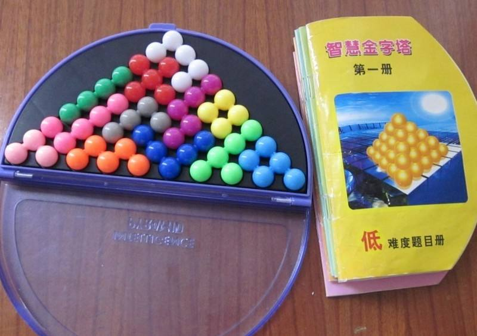

这个玩具有一个棋盘，上面有55个位置，组成底边为10，高也为10的一个三角形（也就是金字塔形）。另有12片积木。

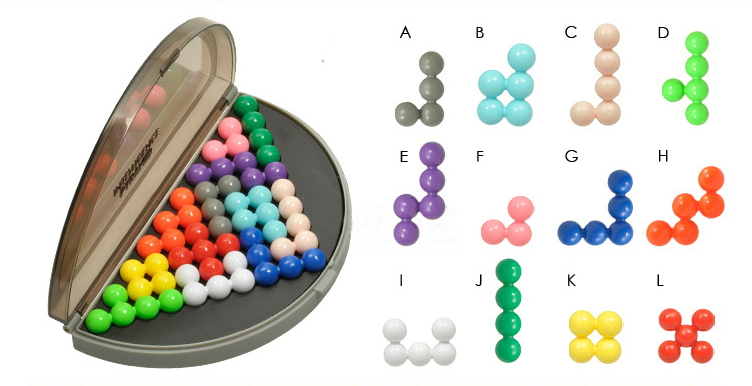

玩具的目的就是想办法用这些积木填满棋盘上的位置，不能有空的位置，积木也不能重叠。

当时感觉挺有意思的，后来回家自己买了一个，琢磨了几个小时，拼出了四五种不同的解法，然后开始思考总共有多少种解法。

这种问题当然是编程用计算机解决啦。

# 方法

这个问题明显属于**精确覆盖**问题的范畴。精确覆盖（Exact Cover）问题是指：在一个全集`X`中若干子集的集合为`S`；`S`的子集`S*`，满足X中的每一个元素在`S*`中恰好出现一次。找出这样的一个`S*`，或证明其不存在的方法。详细解释可以查看[Wikipedia的Exact Cover词条](https://en.wikipedia.org/wiki/Exact_cover "https://en.wikipedia.org/wiki/Exact_cover")或[百度百科的“精确覆盖”词条](https://baike.baidu.com/item/%E7%B2%BE%E7%A1%AE%E8%A6%86%E7%9B%96%E9%97%AE%E9%A2%98 "https://baike.baidu.com/item/%E7%B2%BE%E7%A1%AE%E8%A6%86%E7%9B%96%E9%97%AE%E9%A2%98")。

为了描述精确覆盖问题，通常需要构造一个**关系矩阵**。

关系矩阵是一个0-1矩阵，每一个行列交点上的元素非“0”即“1”。矩阵的每行表示所有子集集合`S`的其中一个子集，每列表示全集`X`中的一个元素。矩阵行列交点元素为1表示对应的元素在对应的集合中，不在则为0。

通过这种矩阵表示法，一个精确覆盖问题可以转化为求这个关系矩阵中的若干行的集合，使每列有且仅有一个1。

有了问题的矩阵表达形式之后，我们就可以用高德纳（Donald Knuth）发明的**X算法**（Algorithm X）来求出精确覆盖问题的解。

# 解题步骤

1. 构造数据结构表示12片积木（`Block`）。

    经过观察每一片积木可以用一个4×4的矩阵中的3--5个点的位置集合来表示。
    
    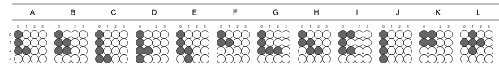

    如积木A可以用坐标集合`Points = {(0, 0), (0, 1), (0, 2), (1, 2)};`表示。

2. 根据每片积木的对称性不同，通过旋转（`Rotate`）和翻转（`Flip`）来构造积木的不同形状（`Shape`）。

    每片积木有8， 4， 2， 或1种不同的形状。
    
    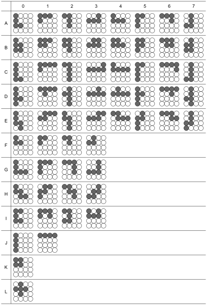

3. 根据形状和需要填充的图案构造关系矩阵。

    三角形金字塔图案的位置这样编号：

    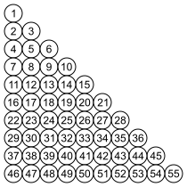

    需要构造的关系矩阵共有55 + 12 = 67列。前55列（1--55列）每一列表示图案中的一个位置，用来保证每个位置会且只会被一块积木占据。

    后12列（56--67列）表示所用积木的编号。例如，56列表示用了积木A，57列表示用了积木B……依此类推，用来保证每块积木都被用上且只用一次。

    矩阵中的一行表示一块积木（`Block`）的一种形状（`Shape`）在棋盘图案上的一个可能的摆放位置`（X,Y）`上所占据的所有棋盘位置的集合。

    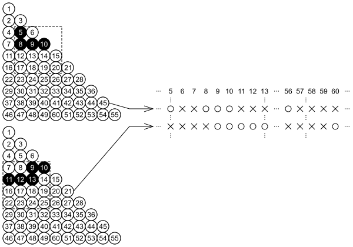

    图中演示了积木A的形状4在矩阵位置（1， 2）构成的一行（第5，8，9，10列为1，表示积木占据的位置。第56列为1表示用了积木A），

    和积木E的形状3在矩阵位置（0， 3）构成的一行（第9，10，11，12，13列为1，表示积木占据的位置。第60列为1表示用了积木E）。

4. 采用X算法求解关系矩阵表示的精确覆盖问题。

    X算法（Algorithm X）最常见的编程实现就是**舞蹈链**（Dancing Links，提出者高德纳　Donald E.Knuth）算法。舞蹈链采用了十字双向循环链表表示关系矩阵中的节点，利用双向链表的快速删除/插入元素的特性实现高效的搜索/回溯，效率很高。

# 求解结果

不考虑对称性，三角形图案的解法共有32288种。考虑到三角形图案是轴对称图案，所有的解法应该是32288 / 2 = 16144种。

# 并行化加速

结果算出来了，但是感觉还不是很满意。计算过程有点慢，能不能再加快一些呢？

观察舞蹈链算法，算法采用了递归--回溯方法对解空间构成的树做深度优先遍历。每一次递归中选择当前节点的一个子节点N，并删除同级的其他的子节点，对解空间树进行剪枝，即将关系矩阵简化为一个更简单的关系矩阵。如果N有子节点，对N的子节点继续同样的操作。最终，遍历到达最底层的节点，途经的各节点的集合即构成一个解，这时关系矩阵简化为确定的单一解矩阵。求出一个解后，回溯到上一层节点，恢复之前删除的子节点，从刚才选择的子节点N的下一个子节点开始，继续搜索下一个解。如果某次遍历最终到达不了最底层的节点，则此次遍历没有解，表现在关系矩阵上即最终简化出的矩阵是无解矩阵。这时同样回溯到上层节点继续遍历寻找下一个解。

传统舞蹈链算法通常始终在同一线程中运行，并不能充分利用多核CPU所有的核心。可不可以在程序中引入并行化，让所有核心都参与到计算过程中呢？

在程序中引入并行化，需要问题可以被分解成为可以并行执行求解过程的一系列子问题。然后，在多个核心或多个CPU上求解子问题，最后把所有子问题的解汇总起来。

舞蹈链算法从根本上是一个**深度优先**的树遍历过程，我们可以从树根开始，先执行**广度优先**遍历，假设根节点为N<sub>0</sub>，它的下一层即第1层n个子节点为N<sub>10</sub>，N<sub>11</sub>，...，N<sub>1n</sub>。执行一遍广度优先遍历后，原先的树被分解为n个树，每棵树的根分别为N<sub>10</sub>，N<sub>11</sub>，...，N<sub>1n</sub>，且树的高度比原先的树少１。对分解出的n棵树同样执行**广度优先**遍历，这样经过L层广度优先遍历后，原有的解空间树就可以分解为一系列的变矮了L层的子树。在这些子树上的求解过程互不影响，可以并行执行。而从根N0到子树的根节点所经过的节点构成了一个部分解，每棵子树对应一个**部分解**。

在每棵子树上运行舞蹈链算法求解，将求得的每一个解和这棵子树对应的**部分解**合并，形成一个**完全解**。最后合并所有子树的**完全解**，就是所有可能的解。

广度优先遍历层次L需要自己确定，很明显L的取值范围是1到树的最大层次M。如果L选的过小，分解出的子树数量太少，就不能充分的并行化，效率的提升有限；如果L选的过大，分解出的子树数量很多，但是每棵子树的高度已经很矮，求解过程太过简单，大量的时间花费在并行任务的切换上，影响效率。在本问题中，解空间树的高度为12，因此L的取值范围为1--12。经过粗略的试验，确定对于本问题L=3时效率最高。

程序采用了Intel的TBB（Threading Building Blocks）并行开发库。

在G3258（3.2G，双核）CPU上运行对比：

未并行加速

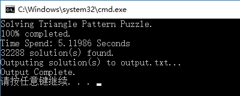

并行加速

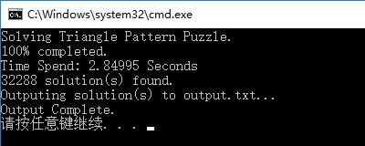

可见有明显的加速，双核心上执行效率几乎提高了一倍。

（测试环境Win10 Pro x64，8G Mem，机械硬盘，G3258 CPU，VS2017编译）

# 矩形棋盘图案

智慧金字塔并不是只能组成一种图案，还可以拼成矩形（11 × 5）图案。

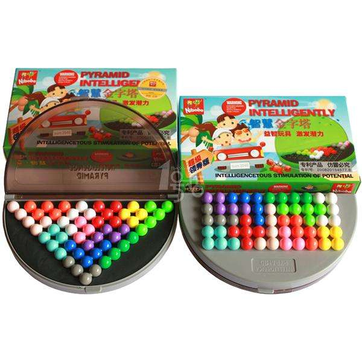

求解矩形所有解法的方法基本与上面三角形图案的一样，唯一不同的是图案的位置编号。

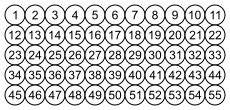

最终解得在不考虑对称的情况下，共有371020种解法。考虑矩形的对称性，共有371020 / 4 = 92755种解法。

# 5层立体金字塔的解法

12片积木可以拼成一个5层的立体金字塔。如下图右边:


即可以拼成这样

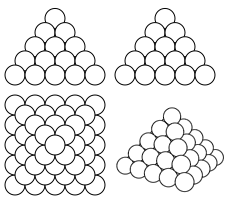

求解依然采用并行化的舞蹈链算法，难点在于构造关系矩阵时，如何确定每块积木所能占据的位置。

我们采用这样的图案位置编号

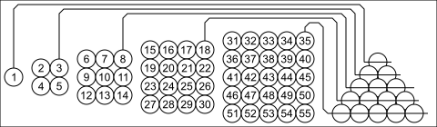

通过观察，积木除了可以在上图的5个水平面上放置，还可以竖起来放在45度和135度的纵切面上。

45°的9个纵切面

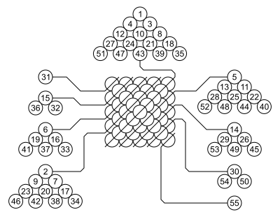

135°的9个纵切面

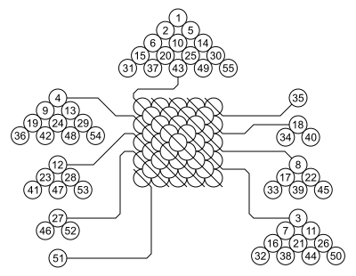

解得共有2448种解法，考虑对称性，共有2448 / 8 = 306种解法

# 4层金字塔的解法

如果不全部用上12片积木，只用一部分，可以拼出4层的立体金字塔。

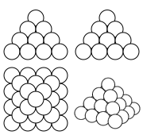

位置编号和5层金字塔的规律一致。在构造关系矩阵时，确定每块积木的位置同样需要考虑在4个水平面，7个45度纵切面和7个135度纵切面上的位置。

与前面情况不同的是，拼的时候并没有全部用上12片积木。因此需要对舞蹈链算法的递归结束条件略加修改。

原先的5层金字塔用到了所有的积木，舞蹈链算法求解的是关系矩阵的若干行的集合，使得每列有且只有一个1。矩阵的1--55列保证每个位置有且只被一块积木占据，56--67列保证每块积木都被用上且只用了一次。

现在没有用上所有积木，在判断递归结束时，就只需要考虑4层金字塔的30个位置（1 + 4 + 9 + 16 = 30）的占据情况，后面的31--42列积木使用情况不需要考虑全部占据。即在程序里当矩阵的前30列（而不需要是所有列）都被`Cover`并被`Delete`时，就可以结束递归。

但31--42列并不能省略，因为这些列保证了每块积木最多只能用1次。

解得共有184种解法，考虑到对称性，共有184 / 8 = 23种解法。

# 编译与运行

程序需要boost中的program_options库和intel的tbb库。下面只介绍Ubuntu 16.04下面的安装方法，其它系统版本上的安装方法请自行研究解决，过程非常简单，没有任何疑点难点。

安装boost
```
    sudo apt-get install libboost-all-dev
```
安装tbb
```
    sudo apt-get install libtbb-dev
```
编译需要g++，程序采用了C++11的特性，需要在编译的时候加上`-std=c++11`参数。
```
    g++ -std=c++11 IQPyramidSolver.cpp -o IQPyramidSolver.o -lboost_program_options -ltbb
```
运行
```
    ./IQPyramidSolver.o --type t --output solutions.txt
```
输出结果到文件`solutions.txt`，或
```
    ./IQPyramidSolver.o --type t
```
输出结果到控制台。


具体可选参数可以执行
```
    ./IQPyramidSolver.o --help
```
查看
